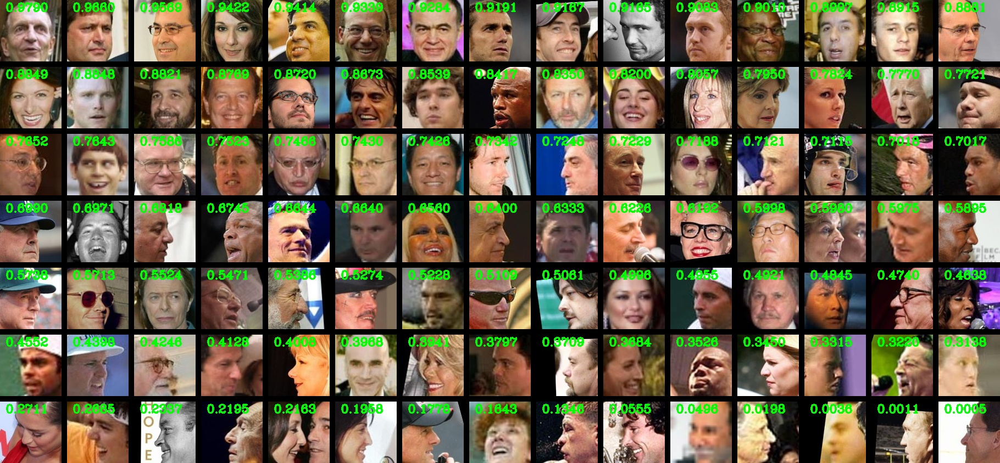
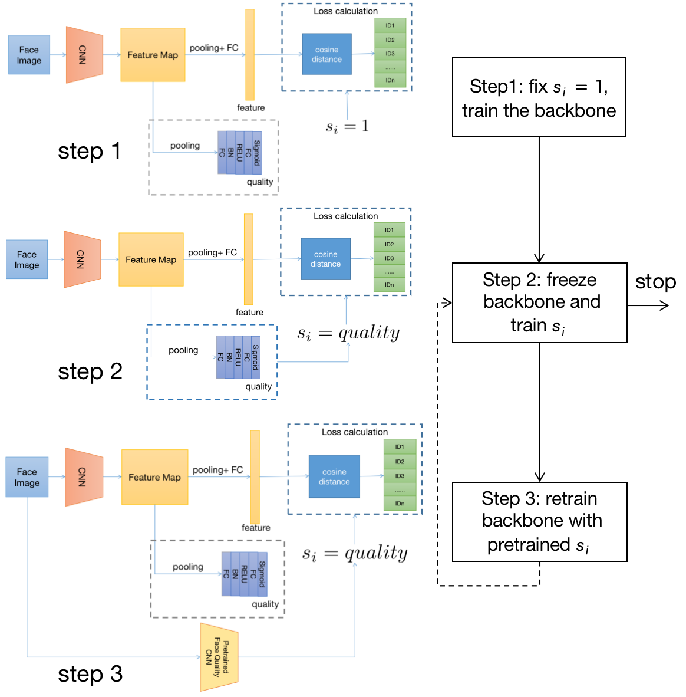
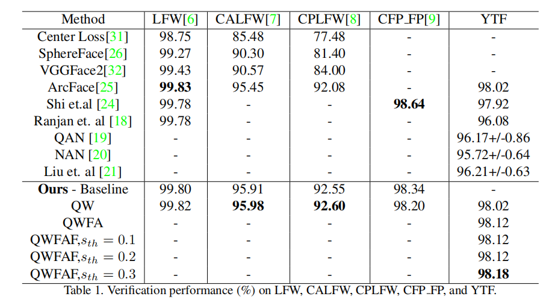
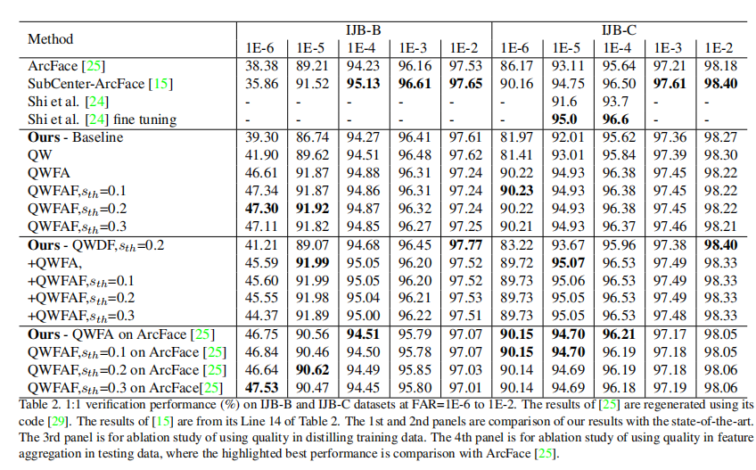
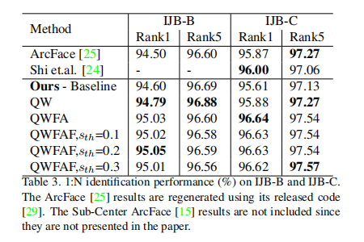

# EQFace: A Simple Explicit Quality Network for Face Recognition 
## The first face recognition network that generates explicit face quality online. It enables a lot of applications where face quality is used.  



## License
The code of EQFace is released under the MIT License. There is no limitation for both academic and commercial usage.

## Requirements
- Pytorch 1.8.1

## Training Data

1. Download [MS1Mv2](https://github.com/deepinsight/insightface/wiki/Dataset-Zoo)
2. Extract image files by [rec2image.py](https://github.com/deepinsight/insightface/blob/master/recognition/common/rec2image.py)
3. Generate the training file list
```
cd dataset
python generate_file_list.py
```

## Test
1. Download pretrained [model](https://drive.google.com/drive/folders/1YtSxo5-NuzDY1baV7wQkUxN3ysvwW6Wp?usp=sharing) 
2. run test_quality.py
```
python test_quality.py --backbone backbone.pth --quality quality.path --file test_faces
```
## Training

1. Step 1: set config.py, then run **python train_feature.py**
```json
    ...
    BACKBONE_RESUME_ROOT = ''
    HEAD_RESUME_ROOT = ''
    TRAIN_FILES = './dataset/face_train_ms1mv2.txt'
    BACKBONE_LR = 0.05
    PRETRAINED_BACKBONE = ''
    PRETRAINED_QUALITY = ''
    ...
```
2. Step 2: set config.py, then run **python train_quality.py**
```json
    ...
    BACKBONE_RESUME_ROOT = './backbone_resume.pth'
    HEAD_RESUME_ROOT = './head_resume.pth'
    TRAIN_FILES = './dataset/face_train_ms1mv2.txt'
    BACKBONE_LR = 0.05
    PRETRAINED_BACKBONE = ''
    PRETRAINED_QUALITY = ''
    ...
```
3. Step 3: set config.py, then run **python train_feature.py**
```json
    ...
    BACKBONE_RESUME_ROOT = ''
    HEAD_RESUME_ROOT = ''
    TRAIN_FILES = './dataset/face_train_ms1mv2.txt'
    BACKBONE_LR = 0.05
    PRETRAINED_BACKBONE = ''
    PRETRAINED_QUALITY = ''

    PRETRAINED_BACKBONE = 'pretrained_backbone_resume.pth'
    PRETRAINED_QUALITY = 'pretrained_qulity_resume.pth'
    ...
```
## Performance Benchmark 




##References 
If you think this work is useful for you, please cite 
@inproceedings{EQFace,
title = {EQFace: A Simple Explicit Quality Network for Face Recognition},
author = {Liu, Rushuai and Tan, Weijun},
booktitle = {CVPRW},
year = {2021}
}


